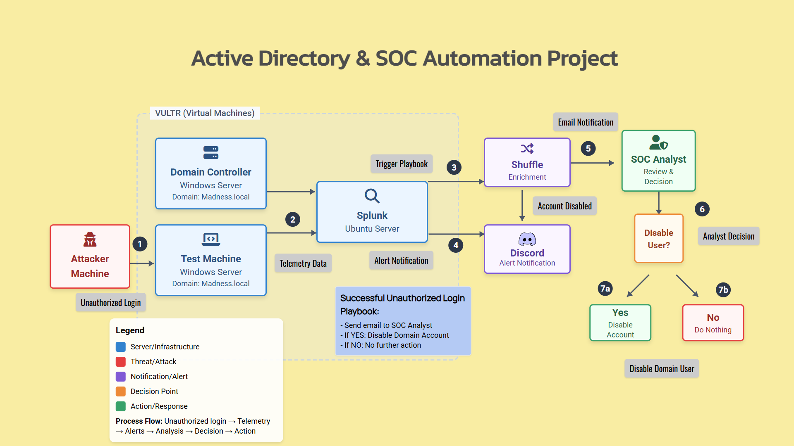

# ActivemDirectory and SOC Automation Project

## Overview
This project simulates a mini SOC environment on cloud-hosted virtual machines.  
It integrates **Active Directory, Splunk, and Shuffle SOAR** to detect and respond to unauthorized RDP login attempts.  

## Architecture Diagram
   

## Key Features
- Deployed AD (Windows Server) + Splunk (Ubuntu) + Test machine on Vultr.
- Configured Splunk to monitor logs and detect unauthorized RDP logins.
- Automated alerts to SOC analyst via Discord & email using Shuffle.
- Enabled automated AD user disablement upon detection.
- Secured VMs with firewall rules.

## Technologies
- Windows Server (Active Directory, Group Policy)
- Ubuntu Server (Splunk Enterprise)
- Shuffle SOAR
- Vultr (Cloud-hosted VMs)
- Discord + Email integrations

