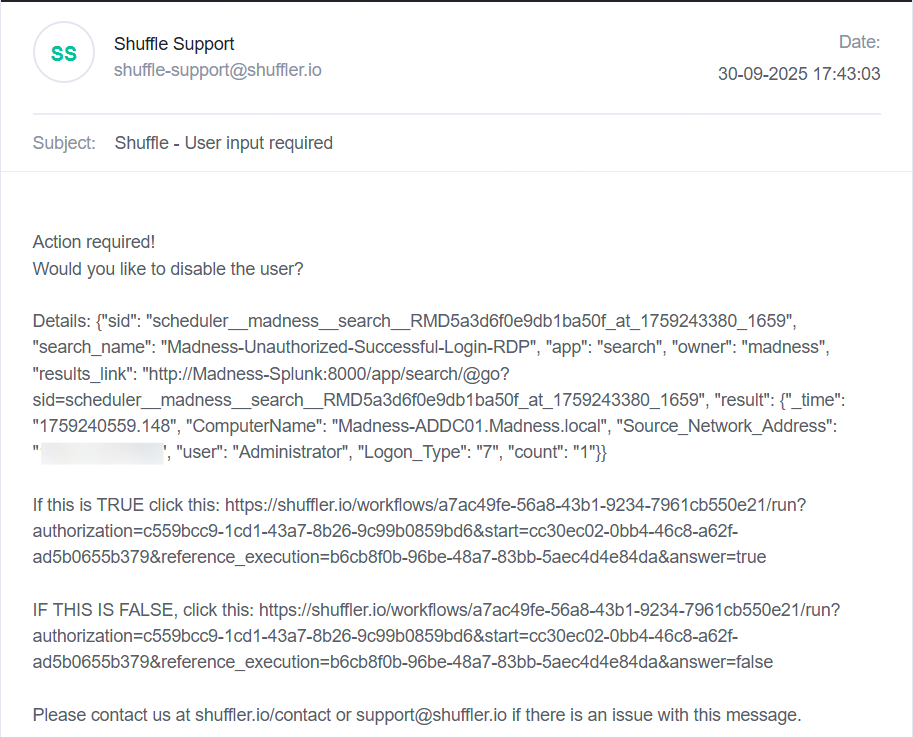
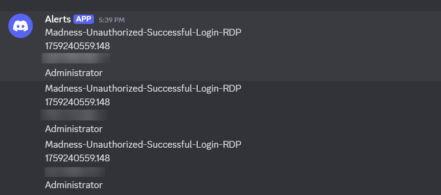
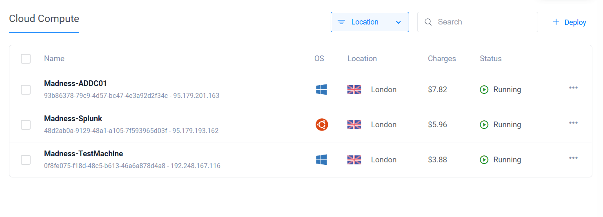

# Active Directory & SOC Automation Project  

## Overview  
This project simulates a mini Security Operations Center (SOC) environment hosted on cloud virtual machines.  
It integrates **Active Directory (AD), Splunk Enterprise, and Shuffle SOAR** to detect and automatically respond to unauthorized Remote Desktop Protocol (RDP) login attempts.  

**Goals:**  
- Demonstrate automated threat detection.  
- Simulate SOC workflow for alerting and remediation.  
- Showcase security automation with real-world tools.  

---

## Architecture Diagram  
  

*Diagram shows the interaction between Active Directory, Splunk, Shuffle SOAR, and alerting channels.*  

---

## Key Features  
- **Infrastructure Deployment**:  
  - Windows Server configured as Active Directory Domain Controller.  
  - Ubuntu Server running Splunk Enterprise for centralized log monitoring.  
  - Test machine for simulating RDP login events.  

- **Security Monitoring & Automation**:  
  - Splunk configured to monitor Windows Event Logs for failed and suspicious RDP logins.  
  - Automatic detection of unauthorized RDP access attempts.  
  - Automated alerts sent to SOC analysts via **Discord** and **Email**.  
  - Automated remediation: disabling AD accounts via Shuffle SOAR.  

- **Security Hardening**:  
  - Firewall rules configured to limit RDP access to trusted IPs.  
  - Least privilege policies enforced in Active Directory.  

---

## Technologies Used  
| Component | Technology / Tool |
|-----------|---------------------|
| Directory Services | Windows Server (Active Directory, Group Policy) |
| Log Management | Splunk Enterprise on Ubuntu Server |
| Orchestration | Shuffle SOAR |
| Cloud Hosting | Vultr (Cloud-hosted VMs) |
| Communication | Discord, Email |
| Security | Firewall configuration, AD user policies |

---

## Workflow Summary  
1. Unauthorized RDP login attempt detected by Active Directory logs.  
2. Logs forwarded to Splunk for analysis.  
3. Splunk alerts sent to Shuffle SOAR via webhook.  
4. Shuffle automates:  
   - Sends alert to SOC team via Discord and email.  
   - Disables offending AD account automatically.
     
---

### 🔹 Email Notification  
 
*An automated email notification is sent to the SOC analyst, providing full context of the security event and affected Active Directory account.*
*You can edit the info in the email to be more readable.*

---

### 🔹 Discord Alert  
  
*The SOC team receives a real-time alert message in the dedicated Discord channel. This ensures immediate visibility and collaboration among analysts.*

---

### 🔹 Shuffle Workflow Diagram  
  
*Visual representation of the automated security orchestration workflow inside Shuffle SOAR, showing detection → alerting → automated response flow.*

---

### 🔹 Vultr Machines Setup  
  
*Diagram showing the Vultr instances running your SOC automation environment, including Splunk, Shuffle SOAR, and Active Directory.*

---

## Benefits  
- Realistic simulation of SOC operations.  
- Demonstrates integration of detection, alerting, and response.  
- Improves security posture through automation and timely remediation.  

